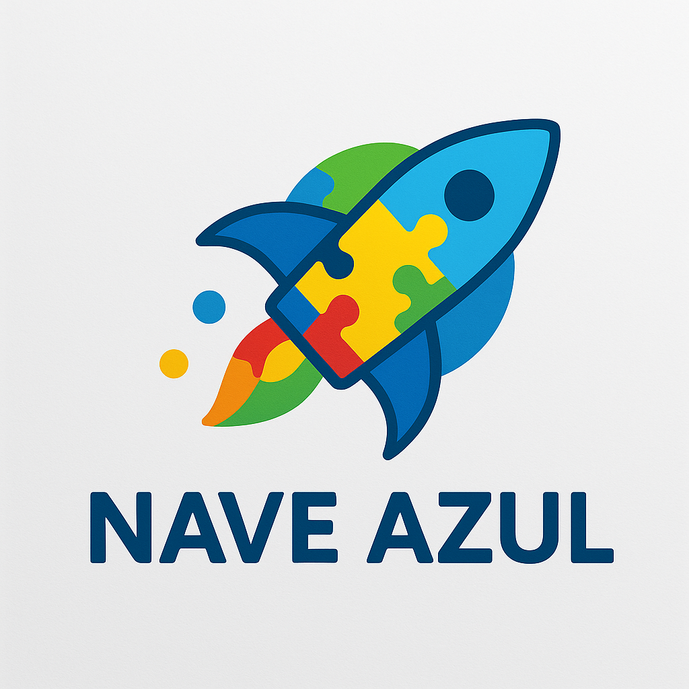

# 🚀 Nave Azul: Jornada Interativa para o Autismo

[](https://github.com/DevLuisairton/Nave-Azul)
[](https://nave-azul.vercel.app/)
<p align="center">
  
</p>
<p align="center">
  <em>Sua jornada de descobertas e apoio no espectro começa aqui!</em>
</p>

## 📜 Índice

- [🚀 Nave Azul: Jornada Interativa para o Autismo](#-nave-azul-jornada-interativa-para-o-autismo)
  - [📜 Índice](#-índice)
  - [✨ Demo Online](#-demo-online)
  - [🌌 Nossa Missão Interestelar](#-nossa-missão-interestelar)
  - [🧭 Nossos Pilares](#-nossos-pilares)
  - [🧑‍🚀 Público-Alvo](#-público-alvo)
  - [💡 Funcionalidades Implementadas e em Desenvolvimento](#-funcionalidades-implementadas-e-em-desenvolvimento)
    - [🛸 Página Inicial (Comando Central)](#-página-inicial-comando-central)
    - [🛰️ Módulo de Exploração (para Indivíduos com TEA)](#️-módulo-de-exploração-para-indivíduos-com-tea)
    - [🛡️ Base de Apoio Estelar (para Cuidadores)](#️-base-de-apoio-estelar-para-cuidadores)
    - [ℹ️ Sobre a Nave (Informações do Projeto)](#ℹ️-sobre-a-nave-informações-do-projeto)
    - [♿ Painel de Acessibilidade Universal](#-painel-de-acessibilidade-universal)
  - [🔮 Funcionalidades Futuras (Roadmap)](#-funcionalidades-futuras-roadmap)
  - [🛠️ Tecnologias Utilizadas](#️-tecnologias-utilizadas)
  - [📂 Estrutura do Projeto](#-estrutura-do-projeto)
  - [🚀 Como Executar o Projeto Localmente](#-como-executar-o-projeto-localmente)
  - [👥 Equipe](#-equipe)

## ✨ Demo Online

Explore a versão atual da Nave Azul em funcionamento!

**Acesse a demo em:** [https://nave-azul.vercel.app/](https://nave-azul.vercel.app/)

## 🌌 Nossa Missão Interestelar

A **Nave Azul** é uma plataforma web interativa, projetada como um portal de acolhimento, informação e recursos para auxiliar no desenvolvimento e bem-estar de pessoas no espectro autista (TEA) e fornecer suporte a seus familiares e cuidadores.

Nossa missão é **criar uma experiência digital inclusiva e engajadora**, que promova o autoconhecimento, a autonomia e o desenvolvimento de habilidades, utilizando ferramentas interativas e um design temático espacial para tornar a jornada mais lúdica e motivadora.

## 🧭 Nossos Pilares

* 🌟 **Autoconhecimento e Empoderamento:** Ajudar o usuário a entender suas características e utilizar suas potencialidades.
* 📈 **Desenvolvimento Contínuo:** Oferecer ferramentas que estimulem habilidades cognitivas, sociais e de comunicação.
* 🌐 **Inclusão e Acessibilidade:** Proporcionar um ambiente digital seguro, adaptável e acessível para todos.
* 🤗 **Apoio Integral:** Fornecer recursos tanto para a pessoa com TEA quanto para sua rede de apoio.

## 🧑‍🚀 Público-Alvo

* Pessoas com Transtorno do Espectro Autista (TEA).
* Familiares e cuidadores que buscam ferramentas de apoio e informação.
* Educadores e profissionais da saúde que trabalham com inclusão e desenvolvimento no TEA.

## 💡 Funcionalidades Implementadas e em Desenvolvimento

A Nave Azul atualmente oferece (ou está em fase final de implementação visual e funcional básica para):

### 🛸 Página Inicial (Comando Central)
* Apresentação do projeto "Nave Azul" com um design temático espacial, incluindo um astronauta animado.
* Navegação clara para os módulos principais: "Módulo de Exploração" e "Base de Apoio Estelar" (através de links para arquivos HTML separados).
* Seção "Nossa Missão Interestelar" com informações sobre o propósito do portal.

### 🛰️ Módulo de Exploração (para Indivíduos com TEA)
Esta seção é projetada para ser um ambiente interativo e de aprendizado (`page_tea.html`):
* **Holo-Dicionário Visual:** Cards interativos com símbolos, nomes e descrições, com suporte a leitura por voz.
* **Laboratório de Serenidade:**
    * **Nebulosa da Respiração Cósmica:** Exercício de respiração guiada com animação visual e instruções.
    * **Transmissor de Ecos Estelares:** Player com sons calmantes.
* **Holodeck Recreativo-Educacional:**
    * **Decodificador de Emoções:** Interface para um jogo de reconhecimento de emoções (lógica básica implementada).
    * **Placeholders para Jogos Futuros:** "Construtor de Sequências Lógicas", "Conector de Constelações", "Colorindo Galáxias", "Quebra-Cabeça Cósmico".
* **Planejador de Missões Diárias (Rotinas Visuais):** Interface para um sistema de criação e acompanhamento de rotinas visuais (lógica básica com `localStorage`).
* **Painel de Comunicação Universal (CAA Simples):** Botões com imagens/texto para auxiliar na expressão (interação básica de leitura de texto).
* **Laboratório de Exploração Sensorial (Placeholder):** Espaço para futuros desafios.

### 🛡️ Base de Apoio Estelar (para Cuidadores)
Um centro de recursos e suporte (`page_cuidador.html`):
* **Biblioteca de Recursos:** Cards com links para guias, vídeos e modelos.
* **Escudos de Autocuidado:**
    * **Abas Interativas:** Navegação entre "Relaxamento", "Comunidade" e "Profissionais".
    * **Relaxamento:** Exercício de respiração e player de áudio adaptados.
    * **Comunidade e Profissionais:** Links e placeholders para busca.
* **Protocolos de Emergência:** Cards com contatos rápidos e informações.

### ℹ️ Sobre a Nave (Informações do Projeto)
Página dedicada (`page_sobre.html`):
* Descrição do projeto como uma iniciativa do Hackathon da UniCesumar.
* Apresentação da equipe de desenvolvimento com cards.
* Links para documentação e repositórios do projeto.

### ♿ Painel de Acessibilidade Universal
Disponível em todas as páginas, oferecendo:
* Ajuste de tamanho da fonte.
* Modo de Alto Contraste.
* Modo Escuro (o tema base já é escuro, mas o toggle pode refinar/forçar).
* Fonte para Dislexia.
* Cursor Aumentado.
* Guia de Leitura.
* Destaque de Links.
* Leitor de Tela experimental integrado (com controles de play/pause/stop).
* Opção de redefinir os ajustes.
* Persistência das configurações no `localStorage`.

## 🔮 Funcionalidades Futuras (Roadmap)

A Nave Azul está em constante evolução! Alguns planos futuros incluem:
* **Cadastro e Perfis de Usuários:** Para salvar progresso, personalizações e permitir acompanhamento por profissionais.
* **Módulo de Avaliação Inicial Detalhado:** Para direcionar os usuários aos níveis de suporte e atividades mais adequadas (como a ideia original dos 3 níveis).
* **Expansão dos Jogos e Atividades:** Implementar completamente os jogos placeholders e adicionar novos módulos educativos e terapêuticos.
* **Interatividade Avançada nas Rotinas:** Ferramenta completa de criação de rotinas visuais com mais opções de personalização e notificações.
* **Comunidade Moderada:** Espaço seguro para troca de experiências entre familiares e cuidadores.
* **Relatórios de Progresso Detalhados.**
* **Integração com IA:** Para personalizar a dificuldade dos jogos e sugestões de atividades no Decodificador de Emoções e outros módulos.

## 🛠️ Tecnologias Utilizadas

**Tecnologias Principais:**
<div>
  
  
  
</div>

**Bibliotecas/Ferramentas:**
* Font Awesome (para ícones)
* Google Fonts (Inter, OpenDyslexic)
* Tippy.js (para tooltips, se mantido na página do cuidador)
* AOS - Animate On Scroll (para animações de scroll na página inicial, se mantido)

**Deployment & Hosting:**
<div>
  
</div>

## 📂 Estrutura do Projeto

A estrutura de pastas principal do projeto é organizada da seguinte forma:
```
/ (Raiz do Projeto)
|-- index.html             (Página Inicial)
|-- README.md
|-- src/
|   |-- assets/
|   |   |-- css/
|   |   |   |-- accessibility.css
|   |   |   |-- animations.css
|   |   |   |-- config_global.css
|   |   |   |-- footer.css
|   |   |   |-- header.css         
|   |   |   |-- main_layout.css
|   |   |   |-- page_cuidador.css
|   |   |   |-- page_home.css
|   |   |   |-- page_sobre.css
|   |   |   |-- page_tea.css
|   |   |
|   |   |-- img/
|   |   |   |-- desenvolvedores/   
|   |   |   |-- logo_fundo_branco.png
|   |   |   |-- logo_fundo_transparente.png
|   |   |   |-- (Outras imagens do projeto)
|   |   |
|   |   |-- js/
|   |   |   |-- accessibility_handler.js
|   |   |   |-- footer.js
|   |   |   |-- header.js             
|   |   |   |-- main_script.js        
|   |   |   |-- page_cuidador.js
|   |   |   |-- page_home.js          
|   |   |   |-- page_sobre.js
|   |   |   |-- page_tea.js           
|   |   |   |-- page_tea_tools.js     
|   |   |   |-- screen_reader.js
|   |   |
|   |   |-- sounds/
|   |       |-- forestbird.mp3
|   |       |-- padsound-meditation.mp3
|   |       |-- rain-sound.mp3        
|   |       |-- waves.mp3
|   |       |-- (Outros arquivos de áudio)
|   |
|   |-- pages/                 
|       |-- page_cuidador.html
|       |-- page_sobre.html
|       |-- page_tea.html
```

**Descrição das Pastas Principais:**
* `index.html`: Ponto de entrada principal da aplicação (Página Inicial).
* `src/`: Contém todo o código-fonte e ativos.
    * `assets/`: Agrupa os recursos estáticos.
        * `css/global/`: Estilos aplicados a todas as páginas.
        * `css/pages/`: Estilos específicos para cada página HTML.
        * `js/core/`: Módulos JavaScript com funcionalidades globais ou de componentes reutilizáveis.
        * `js/pages/`: Módulos JavaScript com lógica específica para cada página.
        * `js/main.js`: Script principal que orquestra a inicialização dos demais módulos JS.
        * `img/`, `sounds/`, `docs/`: Respectivos ativos.
    * `pages/`: Arquivos HTML para as páginas secundárias da aplicação.

## 🚀 Como Executar o Projeto Localmente

Este projeto é composto por arquivos HTML, CSS e JavaScript estáticos.

1.  **Clone o Repositório:**
    ```bash
    git clone [https://github.com/DevLuisairton/Nave-Azul.git](https://github.com/DevLuisairton/Nave-Azul.git)
    ```
2.  **Navegue até a Pasta do Projeto:**
    ```bash
    cd Nave-Azul
    ```
3.  **Abra o Arquivo Principal no Navegador:**
    * Localize o arquivo `index.html` na pasta raiz do projeto.
    * Abra-o diretamente com o seu navegador de preferência (ex: Google Chrome, Firefox, Edge).


## 👥 Equipe

A equipe por trás da Nave Azul é composta por:

| Integrante                                                        
| ----------------------------------------------------------------- 
| Luis Airton ([@DevLuisairton](https://github.com/DevLuisairton)) 
| [Nome Membro 2] ([@mariaeduardadprado](https://github.com/mariaeduardadprado))   
| [Nome Membro 3] ([@EduardaNascimento0906](https://github.com/EduardaNascimento0906))   
| [Nome Membro 4] ([@beny-tomonaga](https://github.com/beny-tomonaga))   


